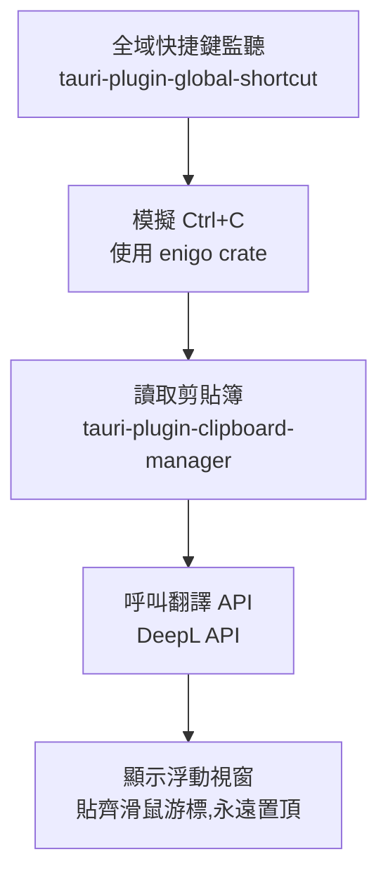

# Select-Translate 劃詞翻譯工具

## 專案目標

在 Windows 上,不論使用者在哪個應用程式裡選取文字(網頁瀏覽器、PDF 閱讀器、Word 等,不限單一 App),按下設定好的全域快捷鍵後,自動偵測選取內容、呼叫翻譯 API,並在滑鼠游標旁彈出一個浮動小視窗顯示翻譯結果。

## 技術棧

- **框架**:Tauri 2.x
- **後端語言**:Rust
- **前端**:純 HTML / CSS / JavaScript(刻意不使用 React、Vue 等框架)
- **套件管理**:npm
- **專案名稱**:select-translate
- **目標平台**:目前僅 Windows

## 核心架構

流程說明:

1. **全域快捷鍵監聽**——App 以背景常駐方式執行,不限焦點在哪個視窗都能偵測到快捷鍵
2. **模擬 Ctrl+C**——偵測到快捷鍵後,模擬複製動作,把使用者當下選取的文字複製進系統剪貼簿
3. **讀取剪貼簿**——取得剛複製到的文字內容;複製後剪貼簿不會立即更新,需要短暫延遲(約 50–150ms)才讀取,否則可能拿到舊內容
4. **呼叫翻譯 API**——把文字送給 DeepL API,取得翻譯結果
5. **顯示浮動視窗**——用 Tauri 的多視窗機制,開啟一個無邊框、永遠置頂的小視窗,定位在滑鼠游標附近顯示原文與譯文

## 已確定的設計決策

- **系統匣常駐 App**:不顯示一般主視窗,不佔工作列,啟動後只在系統匣留一個圖示,只有觸發翻譯時才跳出浮動小視窗
- **前端不使用框架**:純 JS,理由是後端已經要學 Rust,同時再學 TypeScript 或前端框架會分散心力;等專案完成、Rust 熟悉後再考慮升級
- **剪貼簿還原邏輯從第一版就納入**:模擬 Ctrl+C 會覆蓋使用者原本剪貼簿的內容,因此流程要在複製前先記住舊的剪貼簿內容,翻譯完後寫回去,避免悄悄覆蓋使用者原本複製的東西
- **翻譯 API 選擇 DeepL**:免費額度每月 50 萬字元、永久免費,且明確支援 `ZH-HANT`(繁體中文)作為目標語言,翻譯品質評價優於 Google

## 技術選型理由

- **為什麼是 Tauri,不是 Electron**:Tauri 使用系統原生 WebView(Windows 上是 WebView2),不用像 Electron 那樣打包整個 Chromium,安裝檔體積小很多(個位數~20MB,對比 Electron 常見 100MB+);這次也刻意選 Tauri 作為練習真正動手寫 Rust 的機會(先前只讀過 Rust,沒寫過)
- **為什麼是 DeepL,不是 Google 官方 API**:Google Cloud Translation API 沒有永久免費層、需要綁定帳單;DeepL 免費額度對個人日常使用更划算

## 已知的技術限制

- 模擬 Ctrl+C 對「支援複製貼上」的程式都有效,但少數受保護的 PDF 或防拷貝設計的內容會擋掉——這是這個方案本身的天花板,不是實作沒做好
- Rust 專案第一次編譯會比較慢(要把所有相依套件從原始碼編譯一次),屬正常現象

## 可能的 v2 方向(尚未決定要不要做)

參考開源專案 Pot(pot-desktop,同樣用 Tauri 開發的跨平台劃詞翻譯工具)的設計,未來可以考慮加入:

- **剪貼簿監聽模式**:被動監聽剪貼簿變化,不主動模擬按鍵,對會擋掉模擬複製的軟體更保險
- **截圖 OCR 翻譯**:針對完全無法選取文字的內容(圖片、掃描版 PDF),改用截圖 + OCR 辨識文字再翻譯

## 開發環境建議

- IDE:VS Code
- 建議安裝的擴充套件:
  - [Tauri](https://marketplace.visualstudio.com/items?itemName=tauri-apps.tauri-vscode)
  - [rust-analyzer](https://marketplace.visualstudio.com/items?itemName=rust-lang.rust-analyzer)

## 目前進度

- [x] Tauri + Vanilla JS 專案骨架已建立(`npm run tauri dev` 可正常開啟)
- [ ] 全域快捷鍵設定
- [ ] 模擬 Ctrl+C + 讀取剪貼簿邏輯
- [ ] 呼叫 DeepL API
- [ ] 浮動視窗 UI 與定位邏輯
- [ ] 系統匣常駐設定(隱藏主視窗)
- [ ] 剪貼簿還原邏輯